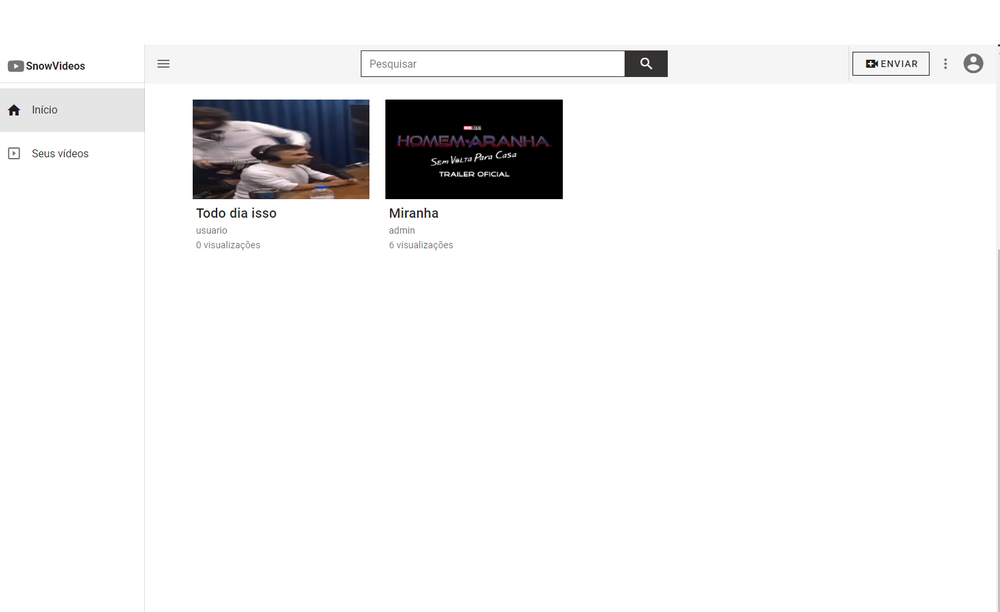
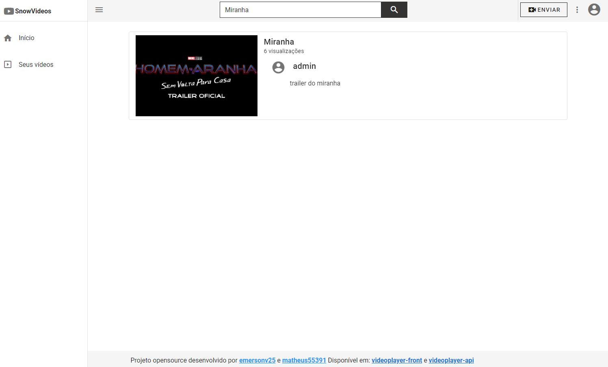
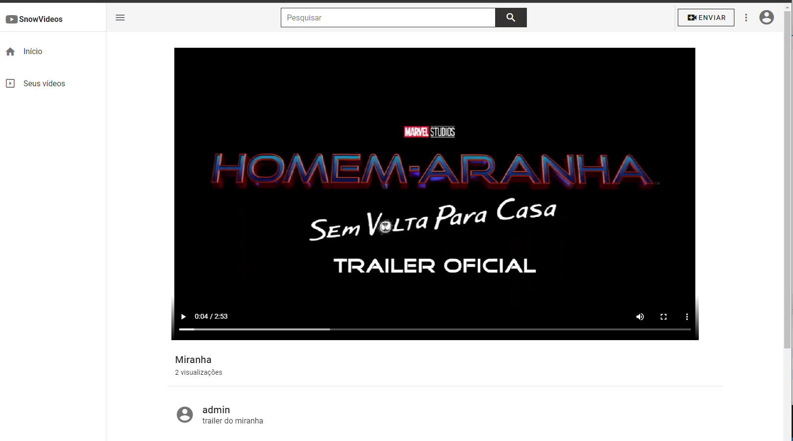
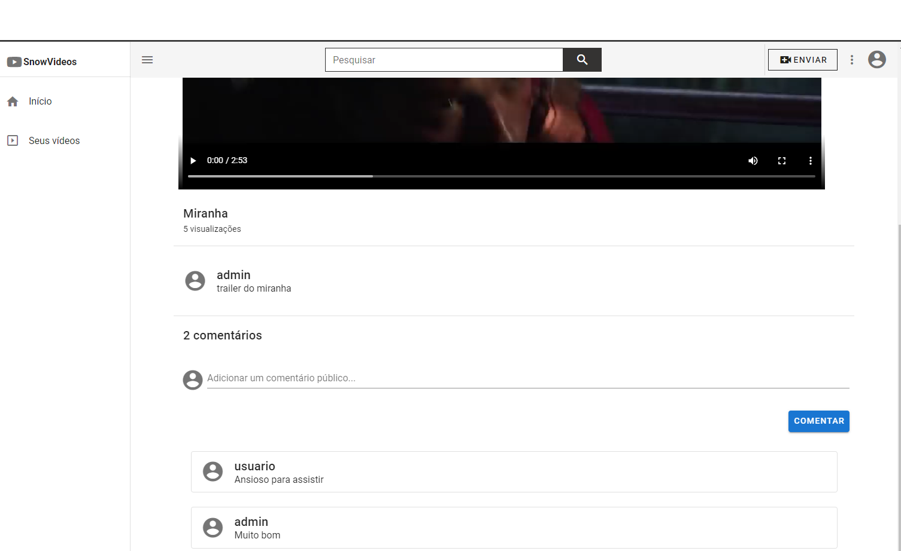
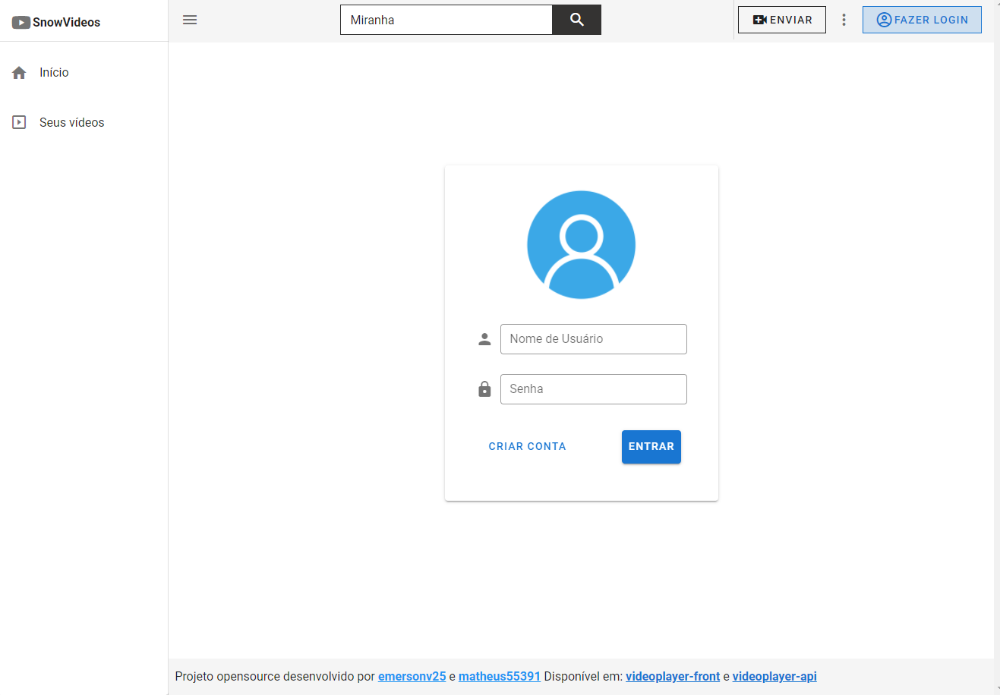
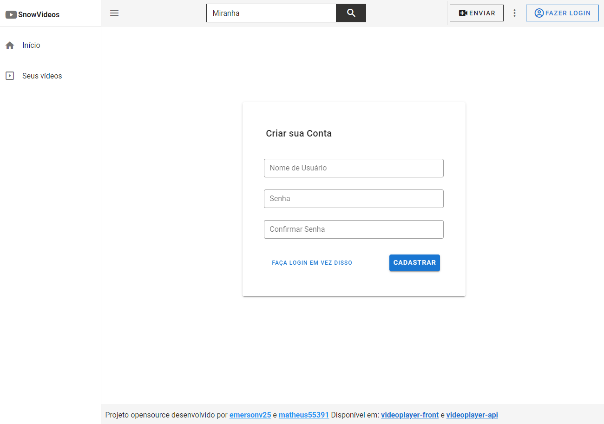
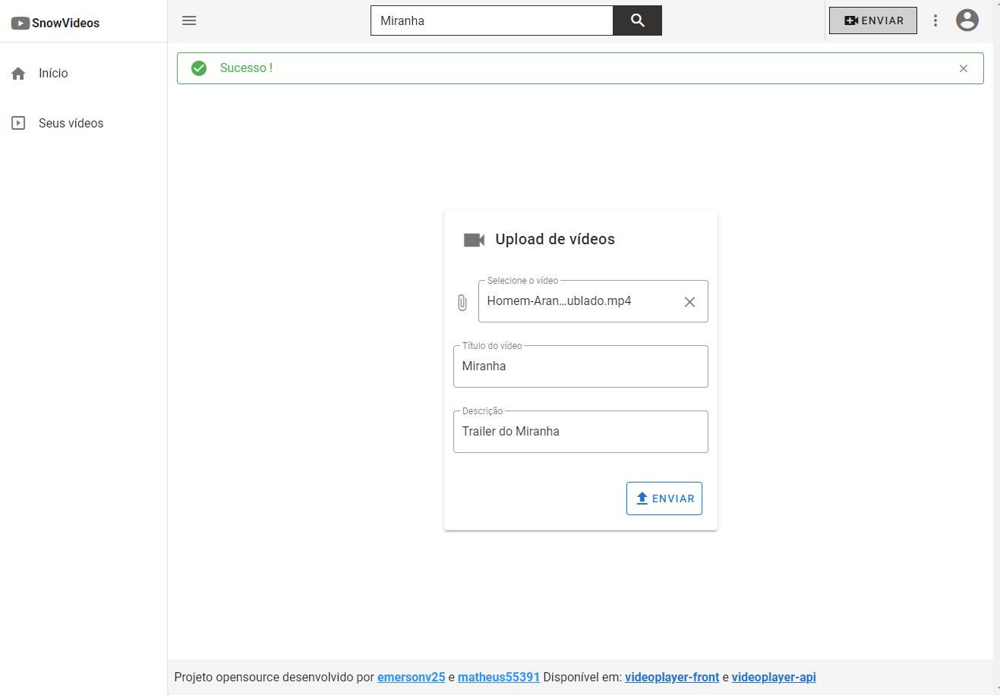
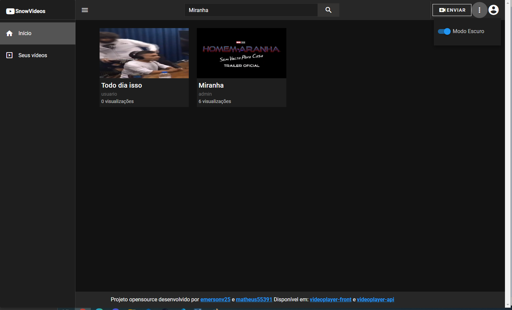

# videoplayer-front

## Visão Geral do Projeto

Um sistema de vídeos baseado no youtube

api: https://github.com/matheus55391/videoplayer-api


# Configurações

## Pre-Requisito: 

**Node.Js**

## Instalar as dependências utilizando o comando 

```
npm install
```

### Iniciar o servidor de desenvolvimento
```
npm run serve
```

### Compilar para produção
```
npm run build
```
**Será gerado uma pasta chamada 'dist' com a versão compilada**

### Lints e reparo dos arquivos
```
npm run lint
```

### Configurações customizadas disponivel em:
[Configuration Reference](https://cli.vuejs.org/config/).


# Configurando url da api do back-end
Editar a url das apis dentro do arquivo
> src/api.json 

```
{

  "url" : "http://localhost:5001/api/"

}
```
* Api disponível em: https://github.com/matheus55391/videoplayer-api


## Prints
* Tela Principal
<p align="left">
  
</p>

* Pesquisar
<p align="left">
  
</p>

* Tela de reprodução
<p align="left">
  
</p>

* Comentários de um vídeo
<p align="left">
  
</p>
* Tela de Login
<p align="left">
  
</p>

* Tela de Registro
<p align="left">
  
</p>

* Upload
<p align="left">
  
</p>

* Modo Escuro
<p align="left">
  
</p>
